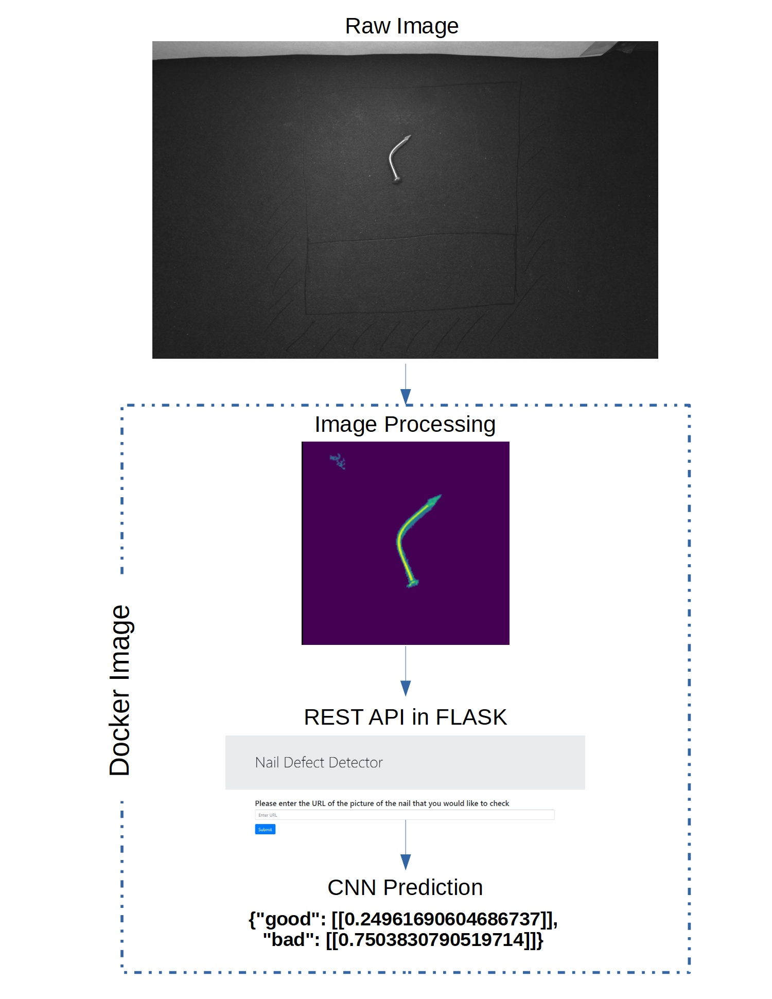

# Nail defect detection
A docker Image that consists of a REST API running on Flask. API allows the user to use a CNN to identifies defect nails. 

## Main Components
- Dockerfile:
  - Instructions for docker image assembly.
- requirements.txt:
  - Python installations for the docker image.
- application.py:
  - Flask main script.
- nail_defect_detector.py:
  - Functions for image preprocessing and model prediction.
  
- EDA_model_training.ipynb:
  - EDA of raw data and training of the model.
- environment.yml:
  - Conda virtual environment configuration for EDA_model_training.ipynb.

## Usage
    docker build -t <docker-image-name-of-your-choice> . 
    docker run -d -p 5000:5000 <docker-image-name-of-your-choice>  
    curl http://<DOCKER-IP>:5000/predict?image_url=http://domain.com/image.jpeg

